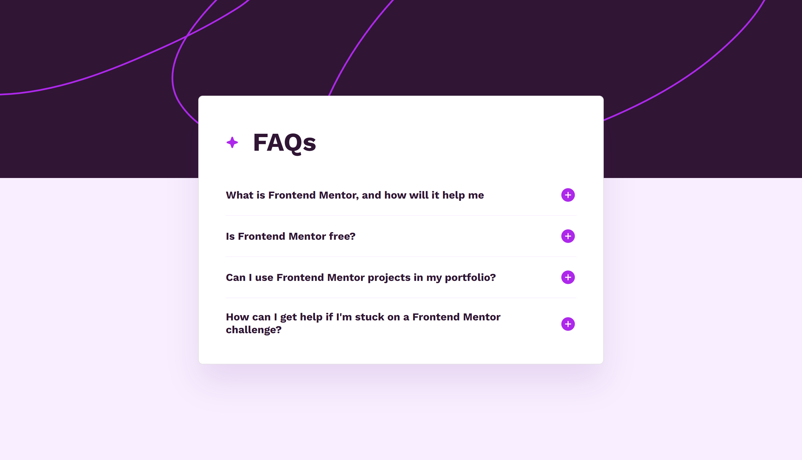

# Frontend Mentor - FAQ accordion solution

This is a solution to the [FAQ accordion challenge on Frontend Mentor](https://www.frontendmentor.io/challenges/faq-accordion-wyfFdeBwBz). Frontend Mentor challenges help you improve your coding skills by building realistic projects.

## Table of contents

- [Overview](#overview)
  - [The challenge](#the-challenge)
  - [Screenshot](#screenshot)
  - [Links](#links)
- [My process](#my-process)
  - [Built with](#built-with)
  - [What I learned](#what-i-learned)
  - [Useful resources](#useful-resources)
- [Author](#author)

## Overview

### The challenge

Users should be able to:

- Hide/Show the answer to a question when the question is clicked
- Navigate the questions and hide/show answers using keyboard navigation alone
- View the optimal layout for the interface depending on their device's screen size
- See hover and focus states for all interactive elements on the page

### Screenshot

### Links

- [Solution URL](https://github.com/ralphvirtucio/faq-accordion)
- [Live Site URL](https://ralphvirtucio.github.io/faq-accordion/)

## My process

### Built with

- Semantic HTML5 markup
- CSS custom properties
- Flexbox
- CSS Grid
- Mobile-first workflow

### What I learned

Doing this challenges, I learned how we should utilize or always implement different accessibility so all users can navigate and use the website or web application you created.

### Useful resources

- [Fluid Responsiveness](https://utopia.fyi/) - This helped me to generate a fluid typography and spacing.
- [Accordion Patterns](https://www.w3.org/WAI/ARIA/apg/patterns/accordion/) - This is an amazing article which helped me finally understand accordion pattern. I'd recommend it to anyone still learning this concept.

## Author

- Frontend Mentor - [@ralphvirtucio](https://www.frontendmentor.io/profile/ralphvirtucio)
